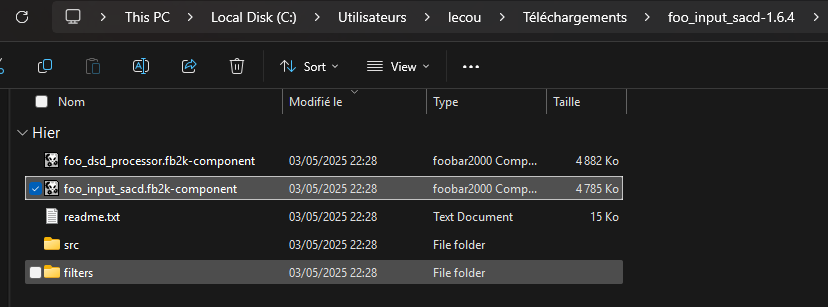

# Lire des fichiers provenant d'un SACD (.dsf) sur Windows

## Installation de :simple-foobar2000: foobar2000

Il faut le télécharger à [cet endroit](https://www.foobar2000.org/download).

Puis l'installer comme un logiciel normal.

## Installation du plugin

Il faut ensuite télécharger le plugin à [cet endroit](https://sourceforge.net/projects/sacddecoder/files/foo_input_sacd/).
Puis après avoir extrait le dossier, ouvrir le fichier foo_input_sacd.fb2k-component :
<figure markdown="span">
  { width="500" }
</figure>

Puis foobar2000 va installer le plugin et demande de se relancer.