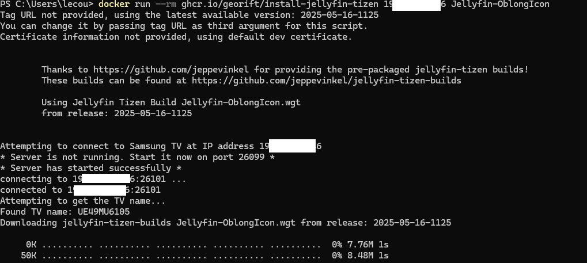

# Installation de Jellyfin sur une TV Samsung 2017 sur Tizen

!!! info
    J'ai choisi l'option OblongIcon pour avoir la bonne icône sur l'écran d'acceuil de la TV.

https://github.com/Georift/install-jellyfin-tizen

Activer le mode développeur de la TV + mettre l'IP du PC

<figure markdown="span">
  { width="500" }
</figure>

Installer Docker Desktop puis fairee un 

<figure markdown="span">
  { width="500" }
</figure>

<figure markdown="span">
  { width="500" }
</figure>